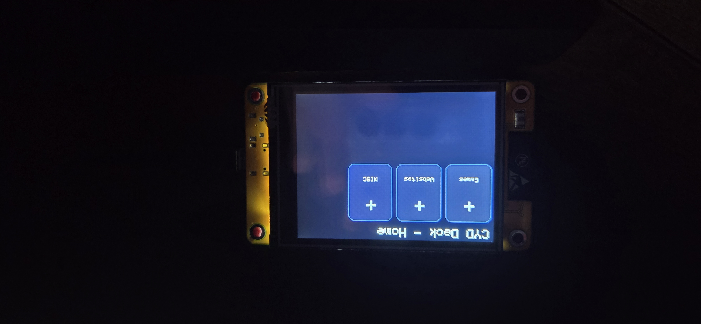

# CYD Deck


[](../../actions/workflows/check.yml)
[](https://www.codefactor.io/repository/github/cam2135/cyd-deck)
[](https://opensource.org/licenses/MIT)


## Languages


A DIY Stream Deck built on the **ESP32-2432S028 (Cheap Yellow Display)**. Press buttons on the touchscreen to trigger keyboard shortcuts, open apps, navigate websites, and more — all over Bluetooth LE. Configure everything from the included Windows editor app.



---

## What it does

- 8 touch buttons per page, laid out in a 4×2 grid
- Supports **folders** — tap a folder button to open a sub-page; **Home** returns to the root page in one tap
- Multiple pages and profiles, all configured visually in the editor
- Connects to Windows as a standard BLE HID keyboard — no drivers needed
- Deck files use a plain `deck.deck` JSON format and are transferred with an SD card

---

## Hardware required

| Part | Notes |
|---|---|---|
| ESP32-2432S028 | The "Cheap Yellow Display" — [buy on Amazon](https://www.amazon.com/dp/B0FCXDVBVZ/) |
| MicroSD card | Any size, FAT32 formatted |
| USB-C cable | For flashing |
| Windows PC | For the editor and BLE pairing |
| Desktop stand (optional) | [2.8" CYD stand on Printables](https://www.printables.com/model/1166980-28-inch-cheap-yellow-display-cyd-desktop-stand) — 3D printable |

---

## Software setup

### 1. Arduino IDE

Download and install [Arduino IDE 2.x](https://www.arduino.cc/en/software).

### 2. ESP32 board package

In Arduino IDE go to **File → Preferences** and add this URL to *Additional boards manager URLs*:

```
https://raw.githubusercontent.com/espressif/arduino-esp32/gh-pages/package_esp32_index.json
```

Then go to **Tools → Board → Boards Manager**, search `esp32` and install **esp32 by Espressif Systems**.

### 3. Required libraries

Install all of these via **Tools → Manage Libraries**:

| Library | Pinned version | Author |
|---|---|---|
| TFT_eSPI | 2.5.43 | Bodmer |
| XPT2046_Touchscreen | 1.4 | Paul Stoffregen |
| NimBLE-Arduino | 2.5.0 | h2zero |
| ArduinoJson | 7.4.3 | Benoit Blanchon |
| LittleFS (ESP32) | Built into ESP32 core | Espressif |

### 4. Configure TFT_eSPI for the CYD

This is the most important step. TFT_eSPI needs to know your display's pin layout.

1. Copy **`Setup(LOOK AT ME)/User_Setup_Select.h`** into your Arduino libraries folder:
   ```
   C:\Users\YourName\Documents\Arduino\libraries\TFT_eSPI\User_Setup_Select.h
   ```
   Replace the existing file. See [`Setup(LOOK AT ME)/readme.md`](Setup(LOOK%20AT%20ME)/readme.md) for details.

2. The `CYDDeck.ino` sketch already has all the correct pin numbers for the ESP32-2432S028 — you don't need to change anything else.

### 5. Flash the firmware

1. Open `CYDDeck/CYDDeck.ino` in Arduino IDE
2. Select board: **ESP32 Dev Module**
3. Select the correct COM port
4. Click **Upload**

On first boot you'll see a welcome screen. Insert your SD card and the deck will load automatically.

### 6. Load a deck from an SD card

1. Format a microSD card as **FAT32**.
2. In the editor, choose **Write SD card**, then choose the root of that card.
3. Confirm that the card contains a file named exactly `deck.deck` in its root folder. Do not put it inside another folder.
4. Turn on or restart the CYD with the card inserted. The device imports the deck automatically.

After the import, the CYD saves the deck in its own internal flash memory. You can remove the card and the deck will keep working after power is removed or the device is restarted. The SD card is only needed when you want to transfer a new deck to the CYD.

You can also leave the card inserted. In that case, `deck.deck` is imported again every time the CYD starts. That is useful when testing changes, but remember to use **Write SD card** after editing or the older file on the card will replace the device's saved deck at the next restart.

---

## Editor setup

The editor runs on Windows and requires Python 3.10+.

### Install dependencies

```bash
py -m pip install customtkinter tkinterdnd2
```

### Run the editor

```bash
py CYDDeckEditor.py
```

---

## Editor usage

### Pages

Pages are listed in the left sidebar. Click a page to switch to it.

Use **+ Add page** at the bottom of the list to create a new blank page.

### Buttons

Each page holds up to **8 buttons** in a 4×2 grid.

- **+ Button** — adds a new blank button
- **+ Folder** — creates a folder button and a linked page in one step
- **Import app / shortcut** — import `.exe`, `.lnk`, or `.url` files directly from Windows

Click a button to select it and edit it in the **Inspector** on the right.

### Folders

A Folder button navigates to another page on the CYD when tapped. On the device, a **Home** button appears in the top-right corner and always returns directly to the root Home page.

In the editor:
- Double-click a folder card to jump to its page
- Use **← Back** in the page header to go back to the parent
- The Inspector lets you pick which page the folder links to, or create a new one

### Button types

| Type | What it does |
|---|---|
| Keyboard Shortcut | Sends a key combo (e.g. `Ctrl+C`) |
| Application | Opens an app via the Windows Run dialog |
| Website | Opens a URL in the default browser |
| Open File | Opens a file path |
| Open Folder | Opens a folder in Explorer |
| Folder | Navigates to another page on the CYD |

### Recording a keyboard shortcut

1. Select a button and set its type to **Keyboard Shortcut**.
2. Click **Record shortcut** in the Inspector.
3. Press one or more key combinations, such as `Ctrl+C` followed by `Ctrl+V`.
4. Press **Esc**, then **Tab** to save the recorded sequence.

You can also type shortcuts directly in **Action / value**. Separate each shortcut with a comma, for example `Ctrl+C, Ctrl+V`. The firmware supports modifier keys by themselves or in combinations: `Ctrl`, `Shift`, `Alt`, and `Win`. It also supports letters, numbers, punctuation, F1-F24, arrows, Enter, Tab, Escape, Insert, Delete, Home, End, Page Up/Down, Print Screen, Pause, Caps Lock, Num Lock, Scroll Lock, Menu, and the numeric keypad.

### Saving

| Action | Shortcut |
|---|---|
| Save | `Ctrl+S` |
| Save As | `Ctrl+Shift+S` |
| Write to SD card | Toolbar button |

**Save** stores a `.deck` file anywhere on your PC. It is a backup/editing copy and does not change the CYD by itself. **Write SD card** copies the current deck to the root of your SD card as `deck.deck`; restart the CYD with that card inserted to import it.

Recommended workflow:

1. Save your deck on the PC as a backup.
2. Use **Write SD card**.
3. Insert the card in the CYD and restart it.
4. Wait for the deck to load, then remove the card if you do not need it installed.

### Theme and brightness

The editor saves your selected theme and brightness into the deck file. The CYD applies both settings during startup, so restart the device after importing an updated deck to see the change.

---

## File structure

```
CYDDeck_Project/
├── CYDDeck/
│   └── CYDDeck.ino          # Arduino firmware
├── Setup(LOOK AT ME)/
│   ├── readme.md            # TFT_eSPI setup instructions
│   └── User_Setup_Select.h  # Pre-configured TFT_eSPI header
├── CYDDeckEditor.py         # Windows configuration editor
├── deck.deck                # Example deck config (JSON)
├── CONTRIBUTING.md          # How to contribute
└── README.md                # This file
```

---

## BLE pairing

1. Power on the CYD
2. On Windows, go to **Settings → Bluetooth → Add device**
3. Select **CYD Deck**
4. No PIN required — it pairs automatically

The CYD uses a stable static BLE address derived from the chip's MAC, so Windows won't create duplicate entries after a reboot.

---

## Troubleshooting

**Display shows nothing / garbled**
Make sure you replaced `User_Setup_Select.h` in the TFT_eSPI library folder. See the Setup folder.

**Touch is offset or inverted**
Touch calibration values are in `handleTouch()` in the `.ino`. Adjust the `map()` ranges if your CYD revision has different touch limits.

**BLE doesn't appear on Windows**
Make sure NimBLE-Arduino is installed. Also check that your PC's Bluetooth is on and not already paired to another "CYD Deck" entry — remove old pairings first.

**SD card not detected**
Format as FAT32. File must be named exactly `deck.deck` in the root of the card.

**My changes disappear after a restart**
If the SD card stays in the CYD, its `deck.deck` file is imported on every boot. Write the updated deck to the card again, or remove the card after the CYD has imported the version you want.

**A button types into the wrong place**
The CYD acts like a Bluetooth keyboard. Click the app or text field you want to control before pressing the button. Application, website, file, and folder buttons open Windows Run first, then type the configured value and press Enter.

**Editor won't start**
Run `py -m pip install customtkinter tkinterdnd2` and try again.

---

## Contributing

PRs and bug reports are welcome. See [CONTRIBUTING.md](CONTRIBUTING.md) for how to get started, coding guidelines, and how to add your name to the contributors list.

---

## License

MIT — do whatever you want with it.
